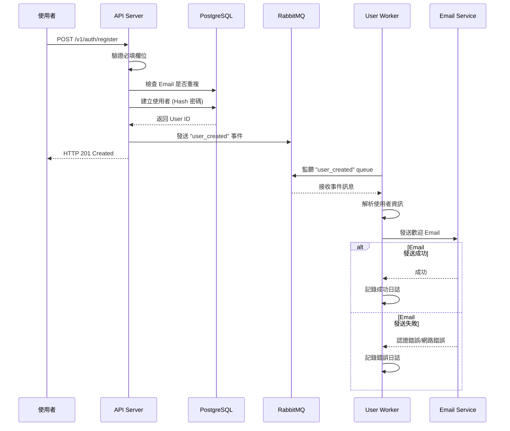

# Go Gin RESTful API

基於 Golang + Gin 架構的 RESTful API，包含 JWT 驗證、CRUD 操作、資料庫連接（PostgreSQL）、Kafka，主要以 user 資源為主，包含註冊、登入、`admin` 有 CRUD 會員 user 的權限。

## 使用技術

需要有這些環境，並在 env 設定。

| 類別        | 技術與框架                |
|-----------|----------------------|
| **後端框架**  | Golang（Gin）          |
| **身分驗證**  | JWT                  |
| **資料庫**   | PostgreSQL（GORM ORM） |
| **快取機制**  | Redis                |
| **訊息佇列** | RabbitMQ (異步任務)、Kafka (日誌)       |
| **EMAIL** | SMTP                 |
| **日誌管理**  | ELK                  |
| **監測工具**  | Prometheus、Grafana   |
| **測試工具**  | K6（壓力測試）             |


## 快速開始

### 安裝 Go

請安裝GO，並且確認你的 Go 版本為 1.23 或更之後更新的版本。

### 安裝依賴
```
go mod tidy
```

### 產生 Swagger 文檔

**第一次使用或更新 API 註解後，需要使用指令產生 Swagger 文檔：**

```bash
go run github.com/swaggo/swag/cmd/swag@latest init
```

這將會在 `docs/` 目錄下產生 swagger.json、swagger.yaml 和 docs.go 檔案。


### 啟動專案

執行以下指令

```bash
go run ./cmd/api
```

啟動後，可以透過以下網址訪問 API 文檔：

- Swagger UI: http://localhost:8000/swagger/index.html
- Prometheus Metrics: http://localhost:8000/metrics
- 健康檢查: http://localhost:8000/health

## 專案結構

本專案採用 **Go 標準專案結構**（cmd/internal/pkg），符合 Go 社群最佳實踐：

```
go-gin-restful-api/
├── cmd/
│   └── api/
│       └── main.go              # 應用程式入口點
├── internal/                     # 內部套件（不對外公開）
│   ├── config/                   # 配置（環境變數、資料庫、JWT、Kafka、Redis 等）
│   ├── database/                 # 資料庫連線與初始化
│   ├── handler/                  # HTTP 處理器（處理 HTTP 請求）
│   ├── middleware/               # 中介層（JWT 驗證、日誌、錯誤處理、監控）
│   ├── model/                    # 資料庫模型
│   ├── repository/               # 資料存取層
│   ├── router/                   # 路由定義
│   ├── service/                  # 商業邏輯層（含單元測試）
│   ├── util/                     # 工具函式（回應格式、錯誤處理）
│   └── worker/                   # 背景任務處理
├── pkg/                          # 可復用的公開套件
│   └── logger/                   # 日誌工具
├── docs/                         # Swagger 文檔
├── tests/                        # 壓力測試、整合測試
└── go.mod                        # Go Module 依賴管理
```

### 結構說明

- **`cmd/`**: 應用程式入口點，每個可執行的應用程式都有自己的子目錄
- **`internal/`**: 內部套件，只能被同一個專案內的程式碼引用，不對外公開
- **`pkg/`**: 可復用的公開套件，可以被外部專案引用
- **`docs/`**: 自動產生的 API 文檔
- **`tests/`**: 測試腳本和測試資料

## 系統架構

### 註冊流程

當使用者註冊成功時，系統採用**事件驅動架構**與**訊息佇列**來處理非同步任務（如發送 Email），避免阻塞 API 回應：



### 核心架構特色

#### 1. **訊息佇列（RabbitMQ）**
- **Queue**: `user_created` - 用於使用者註冊事件
- **Worker**: 後台非同步處理任務
- **優點**: 解耦前端回應與後台任務，提升系統效能

#### 2. **事件驅動設計**
- Controller 僅負責即時回應
- Worker 後台處理非同步任務
- 支援水平擴展 Worker

#### 3. **容錯與日誌記錄**
- Email 發送失敗時記錄錯誤到系統日誌（包括認證錯誤、網路錯誤）
- **Kafka**: 記錄所有 API 請求日誌（含請求方法、路徑、狀態碼、延遲）
- **RabbitMQ**: 處理非同步任務（使用者註冊 Email）
- 完整的錯誤處理機制

#### 4. **監控系統**
- **Prometheus**: 收集 API 指標（請求數量、延遲）
- **Grafana**: 視覺化監控儀表板
- **Health Check**: `/health` 健康檢查端點

## 執行測試

### 單元測試

專案遵循 Go 慣例，單元測試檔案與被測試程式碼放在同一目錄（例如 `services/user_service_test.go`）。

**執行所有單元測試：**
```bash
go test ./...
```

### 壓力測試

使用 K6 進行 API 壓力測試，請確認是否已安裝 K6：

**安裝 K6（如未安裝）：**
```bash
# macOS
brew install k6
```

**執行登入 API 壓力測試：**
```bash
k6 run tests/k6-login-test.js
```

**測試配置說明：**
- 測試會從 50 個虛擬用戶逐步增加到 200 個用戶
- 總測試時間約 60 秒
- 成功標準：95% 的請求需在 500ms 內完成，錯誤率低於 1%
